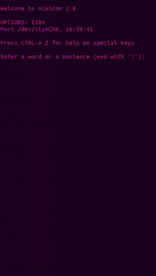

# Morse (Raspberry Pico)



*Example of the serial port communication.*

This project allows you to input a word or sentence using Raspberry usb serial port via the Minicom terminal, convert it to Morse code, and blink an LED on a Raspberry Pi Pico to represent the Morse code. The Morse code translation is also printed back to the terminal.

## Building the Project

1. **Clone the Repository**:
    ```sh
    git clone https://github.com/L-A-Marchetti/Morse.git
    cd Morse
    ```

2. **Compile (if needed)**:
    ```sh
    cd build
    make -j4
    ```

3. **Upload the Code to the Pico**:
    Connect your Raspberry Pi Pico to your computer via USB, then drag and drop the generated `morse.uf2` file from the `build` directory to the Pico.

## Running the Program

1. **Open Minicom**:
    ```sh
    sudo minicom -b 115200 -o -D /dev/ttyACM0
    ```

2. **Interact with the Program**:
    - Enter a word or sentence.
    - End the input with `!`.
    - The program will process the input and start blinking the LED according to the Morse code translation.
    - The Morse code translation will also be displayed in the Minicom terminal.
##